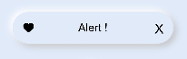

# Neumorphism_Alert

# Installation :

1. Copy the neumorph_alert folder in your repo.
2. Add neumorphism as a dependency in your package.json file.

```json
{
  "dependencies": {
    "neumorphism": "file:../neumorph_alert"
  }
}
```

# Note :

Add this css snippet when passing input or button through slot .

```css
button, input{
    width: 100%;
    height: 100%;
    background-color:transparent;
    text-color: black;
}
```


# Alert



Import:
```html
<element name='neualert' src='../../../../../../node_modules/neumorphism/alert/alert.hml'></element>
```

Usage:
```html
<neualert icon="common/icons/heart.png" width="300px" height="60px" border="40px" >
  <text>Alert !</text>
</neualert>
```

Reference:

<a href="https://neumorphism.io/">neumorphism.io</a>

<a href="https://ismail9k.github.io/neomorphism/">ismail9k.github.io/neomorphism</a>